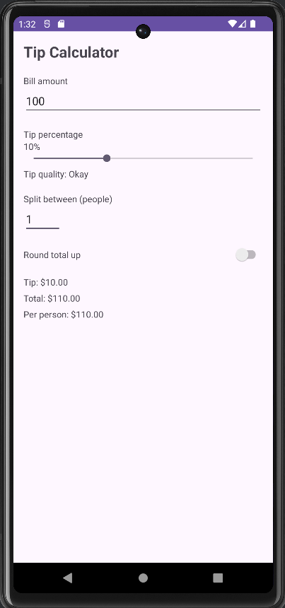
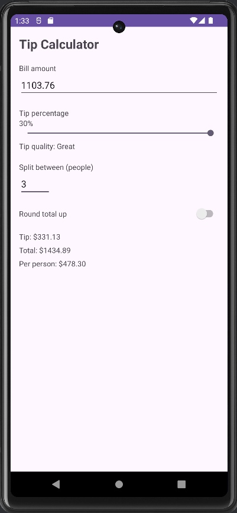
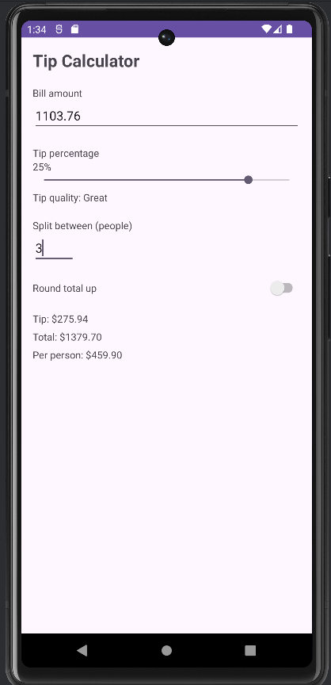
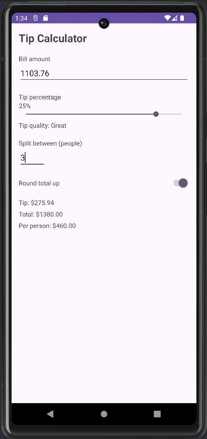

# Tip Calculator App (Android / Kotlin)

## Overview
This project is a rebuilt and improved version of the Tip Calculator app based on the provided tutorial. The goal was to recreate the baseline features from the video and then add my own enhancements to make the app more useful and user-friendly. The app calculates the tip and total amount in real time and updates the UI instantly as the user changes inputs. It also handles bad inputs and uses proper Android resources instead of hard-coded values.

## Enhancements Added
I added two visible and fully functional enhancements:

### 1. Bill Splitting
- Users can enter the number of people.
- The app automatically shows the per-person total.
- Handles invalid inputs (0, empty, negative values).

### 2. Round Total Option
- A toggle switch lets the user round the total up to the nearest whole number.
- Updates calculations instantly.
- Makes the app more flexible for real-world use.

## How to Run the App
1. Clone the repository or download the ZIP.
2. Open the project in Android Studio.
3. Let Gradle finish syncing.
4. Run the app on:
    - An Android emulator
    - Or a real device (USB debugging enabled)
5. The app should compile with no errors and open directly to the main calculator screen.

## APK

## Screenshots

## Video Demo
https://www.youtube.com/watch?v=nHx8xI-qYzQ

## Architecture & Implementation Notes
- The app uses a single `MainActivity` written in Kotlin.
- UI is built using XML with proper use of `strings.xml` and `dimens.xml`.
- Real-time updates are handled through:
    - `TextWatcher` for bill and split inputs
    - `SeekBar.OnSeekBarChangeListener` for the tip slider
    - `Switch` listener for rounding
- Tip descriptions change based on percentage (Poor, Okay, Good, Great).
- Logic is kept simple and readable so calculations remain transparent.

## Reflection (Optional +5%)
If I had more time, I would refactor the project using:
- A ViewModel to handle all state changes
- DataBinding or Compose to reduce boilerplate `findViewById`
- Improved animations or UI transitions for a smoother feel

This would make the app easier to scale and test as more features get added.
